# LLGuidance: Making Structured Outputs Go Brrr

<div class="authors">

* [Michał Moskal](https://moskal.me/)
* [Harsha Nori](https://www.microsoft.com/en-us/research/people/hanori/)
* [Hudson Cooper](https://github.com/hudson-ai)
* [Loc Huynh](https://github.com/JC1DA)

Microsoft

</div>

## Introduction

Large Language Models (LLMs) excel at understanding and generating natural
language. When generating structured data like JSON, XML, or code, they
typically produce syntactically valid outputs, but occasionally fail due to
their probabilistic nature. This becomes problematic when the generated data is
used programmatically for tasks like data extraction, code generation, or tool
calling.

Constrained decoding (also known as structured output generation) is a way of
making sure that the generated output is syntactically valid, by altering the
probability distribution of the next token, which is generated by the LLM.
Essentially, we set the probabilities of all invalid tokens to zero.

Constrained decoding was initially popularized by the
[Guidance](https://github.com/guidance-ai/guidance) library, released by
Microsoft in 2023. [LLGuidance](https://github.com/guidance-ai/llguidance) is a
re-design of the core parsing logic of Guidance, and is now used in Guidance, as
well as in [llama.cpp](https://github.com/ggerganov/llama.cpp/pull/10224),
[Chromium](https://github.com/chromium/chromium/commit/07ca6337c2f714ba0477202414bd2b1692e70594),
[SGLang](https://github.com/sgl-project/sglang/pull/3298),
[vLLM](https://github.com/vllm-project/vllm/pull/14779),
[LLGTRT](https://github.com/guidance-ai/llgtrt),
[mistral.rs](https://github.com/EricLBuehler/mistral.rs/pull/899), and
[onnxruntime-genai](https://github.com/microsoft/onnxruntime-genai/pull/1381).

In August 2024 OpenAI made constrained decoding mainstream by shipping
[Structured Outputs](https://platform.openai.com/docs/guides/structured-outputs)
feature in their REST API, constraining LLM output to a user-provided JSON
schema. By May 2025, OpenAI has switched to use LLGuidance for this feature,
increasing JSON Schema feature coverage and performance.

LLGuidance's main role is quickly computing token masks (sets of allowed tokens)
from user-defined
[context-free grammars (CFGs)](https://en.wikipedia.org/wiki/Context-free_grammar),
representing JSON schemas, programming language syntax, etc. In
[MaskBench](https://github.com/guidance-ai/jsonschemabench/tree/main/maskbench),
a challenging JSON schema benchmark, it computes a token mask in about 50μs on
average, with other libraries being 10-1000x slower (though in some cases this
is due to difficult outliers). Additionally, LLGuidance starts very quickly (2ms
on average), with most other libraries being 1000x slower. LLGuidance was
developed at [Microsoft Research](https://www.microsoft.com/en-us/research/),
between 2023 and 2025.


This performance is due to 4 factors, each contributing 10-100x speedup:

- [Lexer/parser split](#lexer-parser): The very general context-free Earley
  parser is run on top of output from a lexer based on symbolic regular
  expressions. Parser is involved only in 0.1-1% of the token checks.
- [Token trie](#trie): Tokenizer byte strings are organized in a prefix tree
  (trie), which lets us exclude whole subtrees on "syntax error" on a given
  byte. This makes computation of **sparse masks** very fast.
- [Low-level optimizations](#trie-opt): The library is implemented in Rust with
  careful memory layout for the token trie, regex automata, and parser state, as
  well as focusing on avoiding branch mis-predictions.
- [Slicer optimization](#slicer): The tokenizer is segmented into regex-defined
  slices, precomputing masks for each. If a slice is allowed by the lexer, its
  trie traversal is skipped, significantly speeding up dense mask computations.

The slicer optimization is novel, while the other three are effective but
standard algorithmic techniques uncommon in constrained generation contexts.

## Sample grammars

LLGuidance supports an extended Lark
[syntax](https://github.com/guidance-ai/llguidance/blob/main/docs/syntax.md) for
defining grammars. An example grammar for a JSON schema in a reasoning model
might look like this:

```lark
start: <think> "\n" /(.|\n)*/ </think> ( address | refusal )
refusal: "Sorry, I can't help you" /(.|\n)*/
address: %json {
    "type": "object",
    "properties": {
        "street": { "type": "string" },
        "city": { "type": "string" },
        "zip": { "type": "number" }
   },
   "additionalProperties": false,
   "required": ["street", "city", "zip"]
}
```

The `%json ...` part will be translated internally to something like:

```lark
%ignore /[ \t\r\n]+/  // ignore whitespace
address: "{" "\"street\"" ":" STRING "," "\"city\"" ":" STRING
          "," "\"zip\"" ":" NUMBER "}"
STRING: "\"" (PLAIN | QUOTED)* "\""  // still just a regex
PLAIN: /[^\"\\\x00-\x1F\x7F]/
QUOTED: /\\([\"\\\/bfnrt]|u[a-fA-F0-9]{4})/
NUMBER: /-?(0|[1-9][0-9]*)(\.[0-9]+)?([eE][+-]?[0-9]+)?/
```

## Preliminaries

This section explains why quickly computing the exact set of allowed tokens
after the current token results in constrained generation with negligible
overhead. (The set is typically represented as a boolean array called the _token
mask_). If this is already clear to you, you can skip to the
[next section](#fast).

### Tokenizers

LLMs operate on tokens, which are words or subwords. For example, take this
39-byte long string:

`{"question":"THE ULTIMATE","answer":42}`

It is tokenized (with Meta Llama 128k tokenizer) to these 12 tokens:

`{"`, `question`, `":"`, `THE`, ` U`, `LT`, `IMATE`, `","`, `answer`, `":`,
`42`, `}`

We can think of a tokenizer as an array of `N_VOCAB` byte strings where
`N_VOCAB` is typically between 32,000 and 256,000. All the single-byte
bytestrings are included in the array. To tokenize a string, it is typically
first split into "words" by a regular expression that is part of the definition
of the tokenizer. Then each word is split into single-byte tokens. Then, we
successively pick two consecutive tokens and merge them into bigger tokens. We
do it in a specific order, leading to a _canonical_ tokenization of a given
string.

Tokenizers are typically trained, and most LLMs come with their own tokenizers.
Here, we're only interested in the mapping from token numbers to byte strings,
and the canonical tokenizations of strings. (When we say "token" we mean both
the index of the token in the array, as well as the byte string itself.)

LLMs are trained on tokenizations of UTF-8 byte strings; vast majority of these
are canonical, with small exceptions for
[subword regularization](https://arxiv.org/abs/1804.10959). The token byte
strings are either valid or partial UTF-8 sequences (thus, some token sequences
do not correspond to valid UTF-8 byte strings). Due to training, LLMs mostly
output valid UTF-8 byte strings. Constrained decoding can be used to ensure only
valid UTF-8 output, and LLGuidance supports this by default.

We're going to use Python-like pseudo-code to describe the LLM text generation
process. We'll use type `Token` to refer to the token IDs (unsigned integers),
and `array[type; N]` to refer to a fixed-size array of type `type` with `N`
elements.

Let's assume we have the following tokenizer interface:

```python
N_VOCAB = 128_000 # size of the tokenizer
Token = int

def tokenize(text: bytes) -> list[Token]:
    """ Canonical tokenization """

def get_token(tok: Token) -> bytes:
    """ Map a numeric token ID to its byte string representation """

def detokenize(tok_seq: list[Token]) -> bytes:
    return b"".join(get_token(tok) for tok in tok_seq)
```

### LLM text generation

LLMs are often said to be next-token predictors. To be more precise, given a
sequence of tokens, they generate a probability distribution over the possible
next tokens, in other words, table of `N_VOCAB` floating point numbers
describing the probability of each token being the next one.

```python
def LLM(seq: list[Token]) -> array[float; N_VOCAB]:
    """ GPU stuff """

prob = LLM(seq)
assert sum(prob) == 1.0 and all(0 <= p <= 1 for p in prob)
```

We then sample from this distribution to get the next token:

```python
def sample(prob: array[float; N_VOCAB]) -> Token:
    r = random(0.0, sum(prob))
    for i, p in enumerate(prob):
        r -= p
        if r <= 0: return i
```

Normally, there would be additional control parameters for sampling, like
temperature, top-K, and top-P, but they are not relevant here. Given `LLM` and
`sample`, we can generate a sequence of tokens

```python
def generate_tokens(prompt: list[Token], max_tokens: int) -> list[Token]:
    output = []
    while len(output) < max_tokens:
        prob = LLM(prompt + output)
        token = sample(prob)
        output += [token]
    return output

def generate_bytes(prompt: bytes, max_tokens: int) -> bytes:
    return detokenize(generate_tokens(tokenize(prompt), max_tokens))

def generate_str(prompt: str, max_tokens: int) -> str:
    return generate_bytes(prompt.encode("utf-8"), max_tokens).decode("utf-8")
```

### Rejection sampling

Let's say our constraint is implemented with a following incremental parser:

```python
class Parser:
    current: bytes

    def check(text: bytes) -> bool:
        return not syntax_error(self.current + text)

    def consume(text: bytes) -> None:
        self.current += text
        # ... and some cache updates
```

Where the function `syntax_error()` checks if a byte string would generate a
syntax error when parsed by the parser (typically, invalid UTF-8 in the byte
string is also treated as a syntax error). For example, for a parser for generic
JSON syntax:

```python
def test_json_parser(p: Parser):
    assert p.check(b'       {"a":1,"b":"foo"}   ') # full JSON is OK
    assert p.check(b'       {"a":1,"            ') # partial is OK
    assert not p.check(b'   {"a":@              ') # '@' is not a valid JSON token
    assert not p.check(b'   {"a":1]             ') # ']' doesn't match '{'
```

Now, we can sample a token, check it, and repeat until we get a valid token, in
other words we replace `token = sample(prob)` with a `while` loop:

```python
def generate_with_rejection(prompt: list[Token], max_tokens: int) -> list[Token]:
    output = []
    parser = Parser()
    while len(output) < max_tokens:
        prob = LLM(prompt + output)
        while True:
            token = sample(prob)
            if parser.check(get_token(token)):
                break
            prob[token] = 0.0 # do not repeat this token
        output += [token]
        parser.consume(get_token(token))
    return output
```

This function guarantees that the generated sequence is valid according to the
parser's rules.

### Sampling with masks

A problem with rejection sampling is that a new forward pass (invocation of
`LLM()`) cannot start until we're done with sampling, and the `while` loop can
in the worst case run for `N_VOCAB` iterations. This may significantly slow down
the generation process, especially if more than one sequence is generated at the
same time (batched generation), which is often the case in practice.

However, if we can compute `check()` for all tokens in advance, we can overlap
grammar computations taking place on the CPU with the LLM forward pass on the
GPU.

```python
def compute_mask(p: Parser) -> array[bool; N_VOCAB]:
    return [p.check(get_token(i)) for i in range(N_VOCAB)]

def generate_with_mask(prompt: list[Token], max_tokens: int) -> list[Token]:
    output = []
    parser = Parser()
    while len(output) < max_tokens:
        prob = LLM(prompt + output) # GPU
        mask = compute_mask(parser) # CPU
        prob[~mask] = 0.0           # set invalid tokens to 0.0
        token = sample(prob)
        output += [token]
        parser.consume(get_token(token))
    return output
```

Here, `compute_mask()` can run on the CPU during the time it would be normally
just waiting for the GPU to finish. The line `prob[~mask] = 0.0` would normally
be fused into the softmax kernel in the last stage of the LLM, with negligible
overhead. Therefore, as long as the `compute_mask()` function completes faster
than the LLM forward pass and `parser.consume()` is negligible (typically
follows from `compute_mask()` speed), the constrained generation will be as fast
as the unconstrained one.

<a name="fast"></a>

## Computing masks fast

In practice, the time budget to compute the token mask is between 0.1ms and
10ms, depending on the generation batch size (number of concurrent requests to
the inference server), the number of CPU cores available, and the speed of the
model.

This section describes the optimizations used in LLGuidance to meet this budget.

<a name="lexer-parser"></a>

### Lexer/parser split

Back in the 1970s, when computers were slow, compiler writers realized it was
more efficient to first handle words (also called tokens—distinct from LLM
tokens—or _lexemes_) before dealing with syntax. Splitting text into words is
computationally cheaper than parsing it. As a result, regular expressions were
used for "lexing" (breaking text into lexemes), and context-free grammars
handled the higher-level syntax.

For example, consider 27-byte long string `my_variable = "hello world"`. It is
lexed into three lexemes: `ID("my_variable")`, `EQ`, `STRING("hello world")`
(note that the whitespace disappears). Then, the parser turns these into an
`Assignment` node.

This split is theoretically unnecessary, since regular languages are a subset of
context-free languages. However, regular languages can be parsed much more
efficiently. While computers are much faster now, the token masking is a
situation where one has to do lots of parsing in a very short time. Also,
virtually all programming language definitions (including JSON) have this
lexer/parser separation.

Typically the LLM tokens are somewhat aligned with lexemes, meaning that when
checking tokens, the parser needs to be involved in processing of 0.1-1% of
tokens, leaving the rest to the lexer. As a consequence, computing the mask with
a CFG+regex grammar is almost as fast as walking it with regex grammar alone,
while being much more powerful.

To implement CFG+regex parsing, LLGuidance uses:

- [derivre](https://github.com/microsoft/derivre), a custom derivative-based
  (symbolic) regular expression engine, which can construct automaton lazily,
  with very low startup cost, and
- a highly optimized
  [Earley parser](https://en.wikipedia.org/wiki/Earley_parser) for context-free
  grammars (CFGs) on top of the lexer defined with regular expressions

<a name="trie"></a>

### Token trie

LLGuidance organizes byte strings of the tokenizer into a prefix tree (trie),
and then traverses the trie with an incremental parser to compute the token
mask. This section explains how it works.

First, let's update the definition of the parser a little bit. Instead of
checking or consuming a byte string, we allow extending the current string with
a single byte, and popping `n` bytes from the end of the string.

```python
class Parser:
    current: bytes

    def try_push(b: byte) -> bool:
        # conceptual only, normally the parser is incremental
        if not syntax_error(self.current + b):
            self.current += b
            return True
        return False

    def pop_bytes(n: int) -> None:
        self.current = self.current[0:len(self.current)-n]
```

Now, we can define a trie traversal algorithm that computes the token mask.

```python
class TrieNode:
    byte: int
    token_id: Token
    children: list[TrieNode]

parser: Parser
mask: array[bool; N_VOCAB + 1]

def traverse(n: TrieNode):
    mask[n.token_id] = True # mark the token as allowed
    for c in n.children:
        # traverse every child that starts with an allowed byte
        if parser.try_push(c.byte):
            traverse(c)
            parser.pop_bytes(1)
```

Because not all interior nodes of the trie correspond to tokens, we set their
`token_id` field to `N_VOCAB`, and make `mask` have `N_VOCAB + 1` elements. That
last element is ignored when masking the probabilities.

#### Example trie traversal

This subsection shows an example tokenizer trie and how it's traversed for a
particular constraint. Consider a tokenizer with the following tokens:

```python
tokens = [
    b"a", b"ab", b"an", b"and", b"ant",
    b"1", b"10", b"103", b"108", b"1e", b"1e1", b"1e2"
]
```

We can represent the tokenizer as a trie, where each node is a token, and each
edge is a byte.

```mermaid
graph TD
  R[ε]

  R  -- a -->   a["a"]
  a  -- b -->  ab["ab"]
  a  -- n -->  an["an"]
  an -- d --> and["and"]
  an -- t --> ant["ant"]
  R  -- 1 -->   1["1"]
  1  -- 0 -->  10["10"]
  1  -- e -->  1e["1e"]
  10 -- 3 --> 103["103"]
  10 -- 8 --> 108["108"]
  1e -- 1 --> 1e1["1e1"]
  1e -- 2 --> 1e2["1e2"]
```



Let's say we're matching the grammar given by the regular expression `[0-9]+`.

- start traversing the trie with the root node
- move to the first child, `a`
- run `p.try_push('a')`, it returns `False` (as `[0-9]+` doesn't match `a`)
- do not traverse the subtree rooted at `a`

```mermaid
graph TD
  R[ε]

  R  -- a -->   a["❌a"]
  a  -- b -->  ab["╳ab"]
  a  -- n -->  an["╳an"]
  an -- d --> and["╳and"]
  an -- t --> ant["╳ant"]

  R  -. try_push(a) .-> a

  R  -- 1 -->   1["1"]
  1  -- 0 -->  10["10"]
  1  -- e -->  1e["1e"]
  10 -- 3 --> 103["103"]
  10 -- 8 --> 108["108"]
  1e -- 1 --> 1e1["1e1"]
  1e -- 2 --> 1e2["1e2"]
```



- move to the next child of the root node, `1`
- `p.try_push('1')` returns `True`
- add token `1` to the mask
- go down the `0` link to `10`
- `p.try_push('0')` returns `True`, add token `10` to the mask
- `p.try_push('3')` returns `True`, add token `103` to the mask
- `103` doesn't have any children, so call `p.pop_bytes(1)`
- `p.try_push('8')` returns `True`, add token `108` to the mask
- `108` doesn't have any children, so call `p.pop_bytes(1)` to go back to `10`,
  and `p.pop_bytes(1)` again to go back to `1` (instead we could call
  `p.pop_bytes(2)` - see next section)
- `p.try_push('e')` returns `False`, so we skip the whole `1e` subtree

```mermaid
graph TD
  R[ε]

  R  -- a -->   a["❌a"]
  a  -- b -->  ab["╳ab"]
  a  -- n -->  an["╳an"]
  an -- d --> and["╳and"]
  an -- t --> ant["╳ant"]
  R  -- 1 -->   1["✅1"]
  1  -- 0 -->  10["✅10"]
  10 -- 3 --> 103["✅103"]
  10 -- 8 --> 108["✅108"]
  103 -. pop_bytes(1) .-> 10
  108 -. pop_bytes(2) .-> 1
  1  -- e -->  1e["❌1e"]
  1e -- 1 --> 1e1["╳1e1"]
  1e -- 2 --> 1e2["╳1e2"]
```



<a name="trie-opt"></a>

### Optimizing trie traversal

This section describes low-level optimizations for the trie traversal algorithm.
It results in non-recursive algorithm capable of scanning the trie at 13
cycles/node. Many other low-level optimizations are applied in the LLGuidance
library, but they are more standard.

To recall, the trie traversal algorithm is:

```python
class TrieNode:
    byte: int
    token_id: Token
    children: list[TrieNode]

parser: Parser
mask: array[bool; N_VOCAB + 1]

def traverse(n: TrieNode):
    mask[n.token_id] = True # mark the token as allowed
    for c in n.children:
        # traverse every child that starts with an allowed byte
        if parser.try_push(c.byte):
            traverse(c)
            parser.pop_bytes(1)
```

Now, let's put nodes sit in a contiguous array `nodes[]` in
[depth first search](https://en.wikipedia.org/wiki/Depth-first_search) (DFS)
order.

```python
nodes: list[TrieNode]

class TrieNode:
    ...
    level: int        # level in the trie, 0 for root, 1 for children of root, etc.
    subtree_size: int # size of the subtree rooted here (including the node itself)

    # call root.dfs() to compute nodes[], and the fields added above
    def dfs(self, depth = 0) -> None:
        n.depth = depth
        num_nodes = len(nodes)
        nodes += [n]
        for c in n.children:
            c.dfs(depth + 1)
        n.subtree_size = len(nodes) - num_nodes
```

Note that `p + nodes[p].subtree_size` is the index of the node that comes after
this node and all its descendents in DFS order. (In the final implementation, we
won't need `level` and `children` fields.)

Here's how the traversal algorithm looks like (note that we have moved the
`mask` update just before `traverse()` call):

```python
def traverse(p: int) -> int:
    endp = p + nodes[p].subtree_size
    p += 1                          # move to the first child
    while p < endp:
        c = nodes[p]                # current child node
        if parser.try_push(c.byte):
            mask[c.token_id] = True # allow c's token in the mask
            p = traverse(p)         # this moves p by c.subtree_size
            parser.pop_bytes(1)
        else:
            p += c.subtree_size     # skip child
    return p
```

Now, we can remove the recursion. We'll need a new field `num_parents`:
`node[p].num_parents` is defined to be
`node[p].level - node[p + nodes[p].subtree_size].level`, that is the number of
parents of this node we need to pop to get the node that comes after all of
`p`'s descendants in DFS order.

```python
def traverse():
    p = 1 # start with first child of the root node
    while p < len(nodes):
        c = nodes[p] # current node
        if parser.try_push(c.byte):
            mask[c.token_id] = True
            # if the node is a leaf, we pop the parents
            parser.pop_bytes(0 if c.subtree_size > 1 else c.num_parents)
            p += 1 # move to first child, or sibling if no children
        else:
            p += c.subtree_size # skip the children, and go to the sibling node
            # regardless if the node is a leaf, we need to pop all the parents
            # (minus the current one which we didn't push, since try_push() failed)
            parser.pop_bytes(c.num_parents - 1)
```

All of the branches are now predictable, except for the one based on the result
of `parser.try_push()`, which is grammar-dependent (in testing, we get branch
mis-predication rate of under 0.1%). The expression
`0 if c.subtree_size > 1 else c.num_parents` can be computed without branches.
The trie memory is scanned linearly. The mask is accessed randomly--it's
possible a remapping table could be used, but it would complicate sampling.

#### Counting cycles

The following is a breakdown of all memory reads and writes in the Rust
[add_bias_inner()](https://github.com/guidance-ai/llguidance/blob/main/toktrie/src/toktree.rs#L787)
function. This only considers the fast lexer path and is based on assembly code
generated by the Rust compiler for the `add_bias_inner()` function.

- fetch current `TrieNode` (8 bytes); we use 8 bits each for `num_parents` and
  `byte`, and 24 bits each for `token_id` and `subtree_size`
- `try_push()` - 3 reads, 1 write, see below
- updating token bit-mask - 1 read, 1 write
- `pop_bytes()` - only register update (stack length)

The `try_push()` function (see
[try_push_byte()](https://github.com/guidance-ai/llguidance/blob/main/parser/src/earley/parser.rs#L2566)):

- fetch lexer state from the stack (1 read)
- compute next DFA state: 1 read for alphabet compression if enabled, 1 read for
  transition table
- push lexer state to the stack (1 write)

Together, this is 5 reads and 2 writes per node. Dependency chain lengths are
difficult to estimate, given the possible speculation and out-of-order
execution.

On an AMD EPYC 7V13 (a 128-thread server-class CPU commonly used with A100 GPUs)
a single node is processed in around 13 cycles (at 4.2 instructions per cycle);
this drops by 1 cycle if the alphabet compression is disabled (likely only 1
because lexer stack fetch and alphabet compression fetch can be done in
parallel).

The 7V13 has 4 cycles L1 latency (32KB), 13 cycles L2 latency (512KB), and 46
cycles L3 latency (up to 32MB per core, but shared). It also has 6-wide uop
dispatch. Sources:
[EPYC Milan](https://www.anandtech.com/show/16529/amd-epyc-milan-review/4),
[Zen3](https://www.anandtech.com/show/16214/amd-zen-3-ryzen-deep-dive-review-5950x-5900x-5800x-and-5700x-tested/4),
[Zen2](https://www.anandtech.com/show/14694/amd-rome-epyc-2nd-gen/7) (shares
L1/L2 specs).

### Lexer construction

The lexer is based on the `derivre` library, which uses regular expression
derivatives. For a gentle introduction see
[Regular-expression derivatives reexamined](https://www.khoury.northeastern.edu/home/turon/re-deriv.pdf).
The derivative `d(c, L)` of a language (set of strings) `L` with respect to a
character `c`, is the set of words that start with `c` in `L`, with `c` removed,
ie. `{ s | cs ∈ L }`. Derivatives of regular expressions are also regular
expressions, that tell us what to match after consuming a character `c`. For
example:

```
d(a, [ab][cd]) = [cd]
d(a, [ab]+)    = [ab]*
d(a, [ab])     = ε      # matches empty string only
d(c, [ab]c)    = ∅      # doesn't match any string
```

Derivatives can be defined recursively for regular expressions, for example
`d(a, R|Q) = d(a, R) | d(a, Q)`. This also works for intersection and negation
(`d(a, R & Q) = d(a, R) & d(a, Q)`, `d(a, ~R) = ~d(a, R)`), extending the
expressive power compared to standard regular expressions. A regular expression
is _nullable_ if it can match an empty string (for example, `ε` and `[ab]*` are
nullable, while `[ab]+` and `∅` are not).

The regular expressions correspond to states of a
[deterministic finite automaton](https://en.wikipedia.org/wiki/Deterministic_finite_automaton)
(DFA), while the derivatives correspond to transitions. State is accepting if
the regular expression is nullable. The `derivre` library constructs such a DFA
lazily, by caching derivatives. The regular expressions can be simplified using
algebraic laws (like `R|∅ = R`, `R&∅ = ∅`, etc.), reducing the number of states
in the DFA. While the DFA is not necessarily minimal, it is typically much
smaller than the un-minimized DFA resulting from standard determinization of a
[nondeterminstic finate automaton](https://en.wikipedia.org/wiki/Nondeterministic_finite_automata)
(NFA).

The lexer puts regular expressions for all lexemes in a
[hash-consed](https://en.wikipedia.org/wiki/Hash_consing) expression set, with a
single derivative cache (also hash-based). The states of the lexer are sets of
regular expressions, indexed with lexeme index. They are semantically equivalent
to the alternative of the regular expressions, but we use indices to keep track
of them separately, so the lexer can say which lexeme was recognized.

For a given lexer state `{ (l0, R0), (l1, R1), ..., (ln, Rn) }` (where `li` is
lexeme index and `Ri` is regular expression), the state after transition via
byte `c` is defined as `{ (li, d(c, Ri)) | 0 ≤ i ≤ n when d(c, Ri) ≠ ∅ }`. For
every lexer state, we can see which lexemes are still possible in that state.
Each lexer state is assigned a number (hash-consed), and the the transitions are
stored in a simple table (no hashing). Walking the trie mostly involves
successful lookups in that table, and the derivative engine is only used when
the table doesn't yet have the given transition.

### Earley parser optimizations

An [Earley parser](https://en.wikipedia.org/wiki/Earley_parser) keeps track of a
set of _Earley items_ (called _row_) for each lexeme of the input. An Earley
item is a context-free grammar rule with a _dot_ position, signifying how much
of the rule has been matched so far, plus a reference to the Earley row it was
originally created in.

For example, an item `if_stmt -> "if" expr • "then" stmt` means that the parser
has matched the `if` keyword, followed by an expression, and is now expecting
`then` keyword. Often, several items are present in a given row, for example, we
might not know if we're done parsing `expr` in the previous example and so also
have an item `expr -> expr • "+" expr`, signifying that the grammar now expects
either a `+` or a `then`.

See [this article](https://loup-vaillant.fr/tutorials/earley-parsing/) or
[these slides](https://user.phil-fak.uni-duesseldorf.de/~kallmeyer/Parsing/earley.pdf)
for more info.

The Earley parser in LLGuidance is a highly optimized:

- The rules of the grammar are stored in a flat array; Earley items are pairs of
  32-bit integers: an index into rule array (dot position, also implying the
  rule in which the dot is), and index of source Earley row.

- After an Earley row is computed, we determine which lexemes (terminals) are
  allowed in the current state; then we setup the lexer to only recognize these
  lexemes; thus the lexer only allows lexemes that will be allowed by the
  parser, which is critical to detect errors on the first byte. This is related
  to
  [Ruby Slippers](https://jeffreykegler.github.io/Ocean-of-Awareness-blog/individual/2011/11/marpa-and-the-ruby-slippers.html)
  technique in the Marpa parser.

- Normally, when walking down the token trie, rows are added to the parser state
  (pushed) when a lexeme is scanned, and when coming back up, rows are popped.
  Instead, we do not actually pop the rows, but just move a pointer, and if
  we're about to scan a lexeme, we check if it is the same as previously pushed
  lexeme--in that case the row can be reused and doesn't have to re-computed.
  This happens very often.

<a name="slicer"></a>

### Slicer optimization

Generally, computing sparse token masks is cheap. This is because if the lexer
or parser don't allow a given byte in the trie, the entire sub-tree can be
skipped. Thus, for example, a token mask resulting from a regular expression
defining integers is quite quick to compute (as it has only number tokens in it,
which constitute under 1% of the trie).

However, dense masks are slower to compute. They typically happen inside of a
relatively unconstrained context in the grammar. For example, inside of JSON
string, or a comment in a programming language.

We define a number of _slices_: under-approximations of such unconstrained
contexts. Slices are defined by regular expressions typically of the form
`[...]{1,N}` (that is a character class repeated up to `N` times).

For example, a good set of slices for JSON schemas is

- `[^"\\\x00-\x1F\x7F]{1,10}` (`turtle`, ` turtle`, `)!;`, `żółw`, `🐢`, etc.)
- `[^"\\\x00-\x1F\x7F]{1,30}` (`/////////////////////`, ...)
- `[^"\\\x00-\x1F\x7F]+` (`-----------------------------------------`, ...)
- everything else (`"`, `":`, `\`, `\u00`, partial UTF-8, newline, etc.); this
  one is implicit

They all exclude `"`, `\`, and ASCII control characters, all of which have to be
escaped in JSON strings. The first one puts a length limit of `10`, the second
relaxes it to `30`, and the third one catches any remaining lengths of JSON-like
strings, while the implicit fourth one catches everything else.

We then assign each token to the first slice that matches it, and build a token
trie for each slice. The final slice is implicitly defined as the remainder of
the tokens.

As an aside, an equivalent set of the above set of slices is:

```
[^"\\\x00-\x1F\x7F]{1,10}
[^"\\\x00-\x1F\x7F]{11,30}
[^"\\\x00-\x1F\x7F]{31,}
```

When computing the mask, we check if the slice is completely contained in any of
the currently allowed lexemes. That is, we check if the lexer will allow all
tokens in the slice. If that is the case, we add the corresponding mask, and
skip walking the trie of the slice. Otherwise, we walk the trie as usual.

For example, at some position a JSON schema may allow `"foo"`, `"bar"` and
`"C*"` where C is defined as
`[^\"\\\x00-\x1F\x7F]|\\([\"\\\/bfnrt]|u[a-fA-F0-9]{4})`. Here, our JSON slice
`[^"\\\x00-\x1F\x7F]{1,30}` is not contained in any of the allowed lexemes
(because of the initial quote). After scanning token corresponding to the
opening quote `"`, the lexer will allow `foo"`, `bar"` and `C*"`. Now, the JSON
slice is contained in `C*"`, and thus we can skip walking the trie for the
slice.

Another example:

- assume schema has `{ "type": "string", "maxLength": 20 }`
- so after initial quote, the lexer allows `C{0,20}"`
- the JSON slice `[^"\\\x00-\x1F\x7F]{1,10}` is contained in this lexeme, while
  `[^"\\\x00-\x1F\x7F]{1,30}` is not

#### Checking regex containment

To efficiently check if a slice is contained in the prefixes of allowed lexemes,
we use the following under-approximation:

- we only support slices of the form `R{m0,n0}`
- we only check in lexemes of the form `(S{m1,n1} & ~E) T`, where the suffix `T`
  can be ignored (we only care about the prefix), and where `E` has bounded
  length, less than `n1`, and so also can be ignored
- thus, effectively we check if `R{m0,n0}` is contained in the prefix of
  `S{m1,n1}`
- finally, we check if `n0 <= n1` and `R` is contained in `S` (no prefixes this
  time)

This is tailored towards JSON schemas:

- `R` comes from slice definition, typically `[^"\\\x00-\x1F\x7F]`
- `S` is typically a single JSON character (possibly quoted)
- `n1` is infinity for unbounded strings, and a particular number for strings
  with `maxLength`
- `T` is the closing quote
- `E` is a set of strings that are not allowed: this happens when we are
  processing `additionalProperties` and need to exclude properties that have
  explicit definitions

To check if `R` is contained in `S`, we check if `R & ~S` is empty. This is done
via
[symbolic derivatives](https://www.microsoft.com/en-us/research/wp-content/uploads/2025/01/popl25-p11-final.pdf)
(TODO: cite "Regex Decision Procedures in Extended RE#" instead when available).

One may ask, why not use the emptiness check for `R{m0,n0} & ~S{m1,n1}`? First,
we actually need to check `R{m0,n0} & ~Prefixes(S{m1,n1})` which is somewhat
difficult to express, and second the emptiness check grows more expensive with
`n0` and `n1`, whereas the `R & ~S` check needs to be done only once (or a few
times, depending on slice definitions). In fact, an advantage of using symbolic
regular expressions is that special forms like the one above can be identified
and implemented relatively easily.

While we have not conducted extensive experiments with non-JSON grammars, we
believe that a suitable set of slices could be easily defined, serving all
common programming languages.

#### Mask density statistics

The reason the optimization works, is that masks tend be either sparse or
sliceable. Here are statistics of various kinds of masks, across around 2M masks
in
[MaskBench](https://github.com/guidance-ai/jsonschemabench/tree/main/maskbench),
categorized based on how "full" the mask is and whether the slicer optimization
was applied.

| Category         | % Masks | % Time | Time/Mask [us] |
| ---------------- | ------: | -----: | -------------: |
| 0%-2% & !sliced  |   44.6% |  20.7% |             28 |
| 2%-85% & !sliced |    1.1% |  11.0% |            576 |
| 85%+ & !sliced   |    0.5% |  13.0% |           1577 |
| 85%+ & sliced    |   53.8% |  55.0% |             61 |


A little under half of masks are very small (up to 2% of the tokens are
allowed), and in a little over half the slicer optimization can be applied
(there are no masks under 85% full where the slicer can be applied). The
remaining sliver of masks are either intermediate size or large, but the slicer
optimization can't be applied; they take disproportionately long time to
compute.

## Related work

See
[MaskBench](https://github.com/guidance-ai/jsonschemabench/tree/main/maskbench)
in [JSON Schema Bench](https://github.com/guidance-ai/jsonschemabench) for
detailed performance comparisons.

[LM-format-enforcer](https://github.com/noamgat/lm-format-enforcer) and
[llama.cpp grammars](https://github.com/ggerganov/llama.cpp/blob/master/grammars/README.md)
are similar to llguidance in that they dynamically build token masks for every
step of the decoding process. Both are significantly slower - the former due to
clean Python code and the latter due to the lack of a lexer and use of a
backtracking parser, which, while elegant, is inefficient.

[Outlines](https://github.com/dottxt-ai/outlines) builds an automaton from
constraints and then pre-computes token masks for all automaton states,
potentially making sampling fast but inherently limiting constraint complexity
and introducing significant startup cost and memory overhead. LLGuidance
computes token masks on the fly and has essentially no startup cost. The lexer’s
automata in LLGuidance are built lazily and are typically much smaller, as the
context-free grammar imposes the top-level structure.

[XGrammar](https://github.com/mlc-ai/xgrammar) follows an approach similar to
llama.cpp (explicit stack-based, character-level parser) with additional
pre-computation of certain token masks, similar to Outlines. The pre-computation
often runs into seconds, and sometimes minutes. If the pre-computation works
well for a given input, the masks are computed quickly (under 8μs in half of
masks we tested), however if it doesn't fit the particular input, the mask
computation times can run to tens or hundreds of milliseconds.

## Conclusion

LLGuidance delivers fast, grammar-constrained decoding without requiring
pre-computed token masks or automaton states. It supports general context-free
grammars with regex lexers, handling complex structures like full JSON schemas
or programming languages on the fly. Unlike approaches that rely on expensive or
brittle pre-processing, LLGuidance has negligible startup cost and consistent,
predictable performance—even in worst-case scenarios. This makes it suitable for
real-time systems where constraint flexibility, low latency, and bounded compute
costs are critical.
